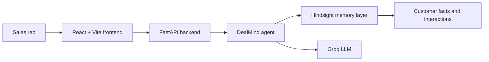

# DealMind

DealMind is an AI sales intelligence agent built to demonstrate persistent memory in a realistic sales workflow. The product uses Hindsight as the memory layer so each customer interaction can be remembered and reused in future conversations.

## Problem Statement

Sales teams often lose context between meetings. Customer preferences, objections, competitors, pricing concerns, and product interests are fragmented across email threads, notes, and chat history. Without a persistent memory layer, each interaction starts from scratch.

## Solution

DealMind stores structured customer facts in Hindsight, recalls the most relevant memories during future conversations, and gives the salesperson a personalized briefing. The agent can summarize customer history, prepare for meetings, and draft follow-ups with context that would otherwise be forgotten.

## Why Hindsight

Hindsight provides a persistent memory layer designed for long-running AI workflows. Instead of relying on a transient chat history, DealMind stores useful customer facts in a durable memory bank and retrieves only the context relevant to the current request.

## Architecture



## Features

- Customer memory capture and recall
- Personalized meeting prep
- Competitor and objection tracking
- Timeline view of important customer interactions
- Demo data for Ravi, Priya, and Arjun
- Memory visibility in UI and API responses

## Technology Stack

- React
- Vite
- JavaScript
- FastAPI
- Python
- Groq
- Hindsight memory layer

## Installation

### Backend

```bash
python -m venv venv
venv\Scripts\activate
pip install -r backend/requirements.txt
```

### Frontend

```bash
npm install
```

## Environment Variables

Create a .env file from .env.example and fill in the values:

```env
HINDSIGHT_API_KEY=PASTE_YOUR_KEY_HERE
HINDSIGHT_BASE_URL=https://api.hindsight.example
HINDSIGHT_BANK_ID=dealmind

GROQ_API_KEY=PASTE_YOUR_KEY_HERE
GROQ_MODEL=llama-3.1-8b-instant
```

> Now enter your API keys manually in the .env file.

## How to Run

### Backend

```bash
uvicorn backend.main:app --reload
```

### Frontend

```bash
npm run dev
```

## Demo Flow

1. Open the dashboard.
2. Ask the agent to prepare for a customer meeting.
3. Observe how the system recalls past facts.
4. Compare the before/after memory demo section.
5. Review the customer timeline and memory panel.

## API Documentation

The backend exposes the following endpoints:

- GET /
- GET /health
- POST /api/chat
- POST /api/memory
- GET /api/customer/{customer_name}/memories
- GET /api/customer/{customer_name}/timeline
- POST /api/customer

## Project Structure

```text
DealMind/
├── backend/
│   ├── __init__.py
│   ├── agent.py
│   ├── config.py
│   ├── main.py
│   ├── models.py
│   ├── prompts.py
│   └── requirements.txt
├── frontend/
│   ├── src/
│   ├── package.json
│   └── vite.config.js
├── .env.example
├── .gitignore
├── README.md
├── requirements.md
└── .env
```

## Future Improvements

- Add real Hindsight SDK integration
- Add multi-customer search and filtering
- Add CRM sync and follow-up automation
- Add richer timeline analytics and memory scoring

## Notes

This project is intended for demonstration and hackathon use. The synthetic customer data should not be treated as real customer information.
